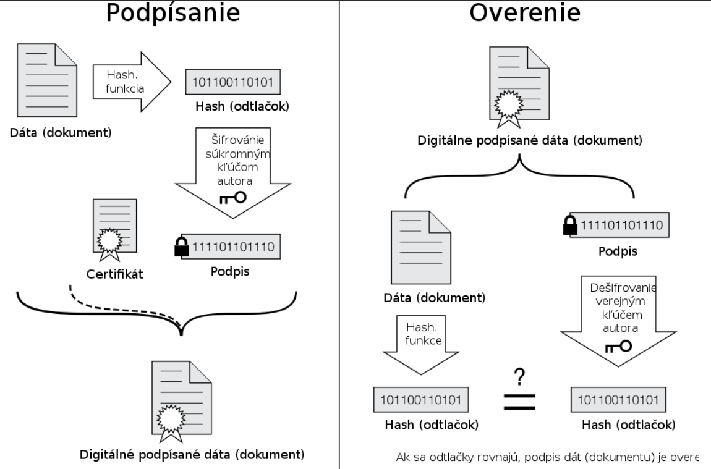
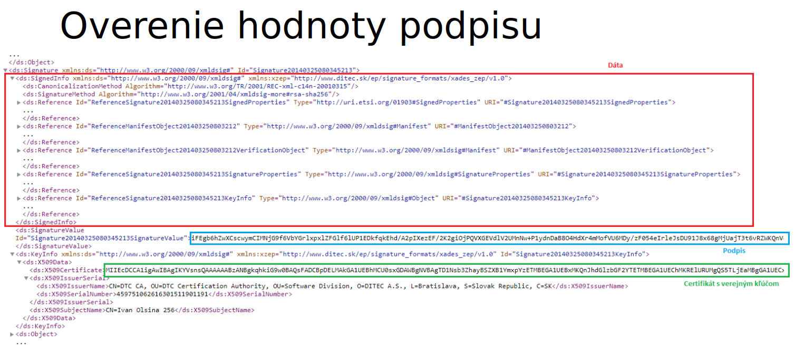
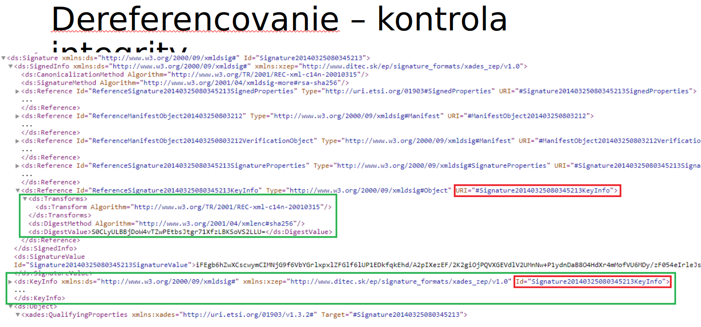

# SIPVS project

## Endpoints

## POST: http://localhost:8080/api/zadanie1/save

Example input:
```
{
  "loanId": "L000002",
  "librarianId": 2,
  "borrower": {
    "cardNumber": "ABCDEFG"
  },
  "dateOfLoan": "2023-10-05",
  "dueDate": "2023-11-05",
  "loanedBooks": [
    {
      "isbn": "9780451524935"
    },
    {
      "isbn": "9780486282114"
    }
  ]
}
```
Example output:
```
"XML file was saved."
```
```
Status 200
```
Example error output:
```
"Save error: [error message]"
```
```
Status 500
```
Data correct format:

| Element | Format | Example |
|---|---|---|
| loan_id | [A-Z][0-9]{6} | A123456 |
| librarianId | integer | 1 |
| dateOfLoan | yyyy-MM-dd | 2023-01-01 |
| dueDate | yyyy-MM-dd | 2023-01-01 |
| cardNumber | [A-Z0-9]{7} | ABC1DEF |
| isbn | [0-9]{10} \| [0-9]{13} | 0123456789, 0123456789012 |

## GET: http://localhost:8080/api/zadanie1/validate

Example input:
```
N/A
```
Example output:
```
"Validation successful. XML is valid against the XSD."
```
```
Status 200
```
Example error output:
```
"Validation error: [error message]"
```
```
Status 422
```

## GET: http://localhost:8080/api/zadanie1/transform

Example input:
```
N/A
```
Example output:
```
"HTML file was saved."
```
```
Status 200
```
Example error output:
```
"Transformation error: [error message]"
```
```
Status 500
```

## GET: http://localhost:8080/api/zadanie2/getxml

Example input:
```
N/A
```
Example output:
```
XML content
```
```
Status 200
```
Example error output:
```
?
```
```
Status 500
```

## GET: http://localhost:8080/api/zadanie2/getxsd

Example input:
```
N/A
```
Example output:
```
XSD content
```
```
Status 200
```
Example error output:
```
?
```
```
Status 500
```

## GET: http://localhost:8080/api/zadanie2/getxsl

Example input:
```
N/A
```
Example output:
```
XSL content
```
```
Status 200
```
Example error output:
```
?
```
```
Status 500
```

## GET: http://localhost:8080/api/zadanie2/generatePdfFromXml

Example input:
```
N/A
```
Example output:
```
PDF content
```
```
Status 200
```
Example error output:
```
?
```
```
Status 500
```

## GET: http://localhost:8080/api/zadanie3/timestamp

Example input:
```
Uploaded signed xml 
```
Example output:
```
XML string with timestamp (unformatted)
```
```
Status 200
```
Example error output:
```
Runtime exception
```
```
Status 500
```

## GET: http://localhost:8080/api/zadanie4/verify

Example input:
```
N/A
```
Example output:
```
N/A
```
```
Status 200
```
Example error output:
```
Runtime exception
```
```
Status 500
```
---
---
### BE
Java 8, Spring Boot

### FE
React, Axios 

#### How to run FE
```
cd sipvs-fe
npm install
npm run dev
```

## Poznamky z cviceni su dostupne tu:
https://docs.google.com/document/d/10XnzfjOgmgRS6fMJsDnlVr5NHXX6PPExP4UaDWbwFIY/edit?usp=sharing


## Podpisovac navod

- stiahnut a nainstalovat D.Lanucher v2.x
  - pozriet si systemove poziadavky k prislusnemu operacnemu systemu
- pridat plugin D.Bridge 2 do prehliadaca
- **? ako to spojazdnit ?**

---
# 4.zadanie - nova implementacia aplikacie (gui/konzola/web)(spravime ako endpoint tuto)
- načítanie vzoriek podpisov a identifikovať problém
  - na základe dokumentu OvereniePodpisu.doc
  - pri identifikovaní problému vypísať konkrétnu chybu z word dokumentu
  - pri identifikovaní problému nepokračovať ďalšími kontrolami, ale hneď skončiť
- možnosť vyhodnotiť vzorky po jednej, alebo aj všetky naraz

## Jeho komentar + z prezentacie
- prenesenie xml na stranu OWM bez zmeny integrity
- identifikovanie vstupneho XADES dokumentu, teba zistit ci je ho mozne parsovat a ci splna poziadavky profilu, namespace, ...

- vsetky data, ktorych integritu chcem chranit, su na ne referencie v cervenom obdlzniku

- dereferencovanie

- CRL = certificate revocation list = zoznam predcasne zrusenych certifikatov (napriklad strateny certifikat)
